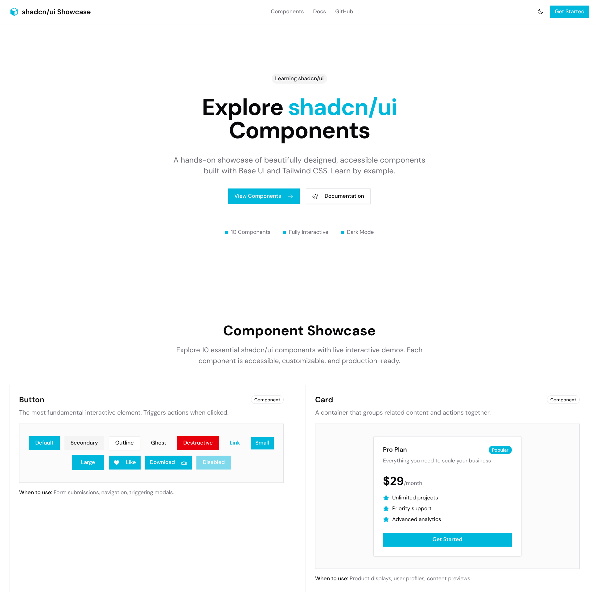
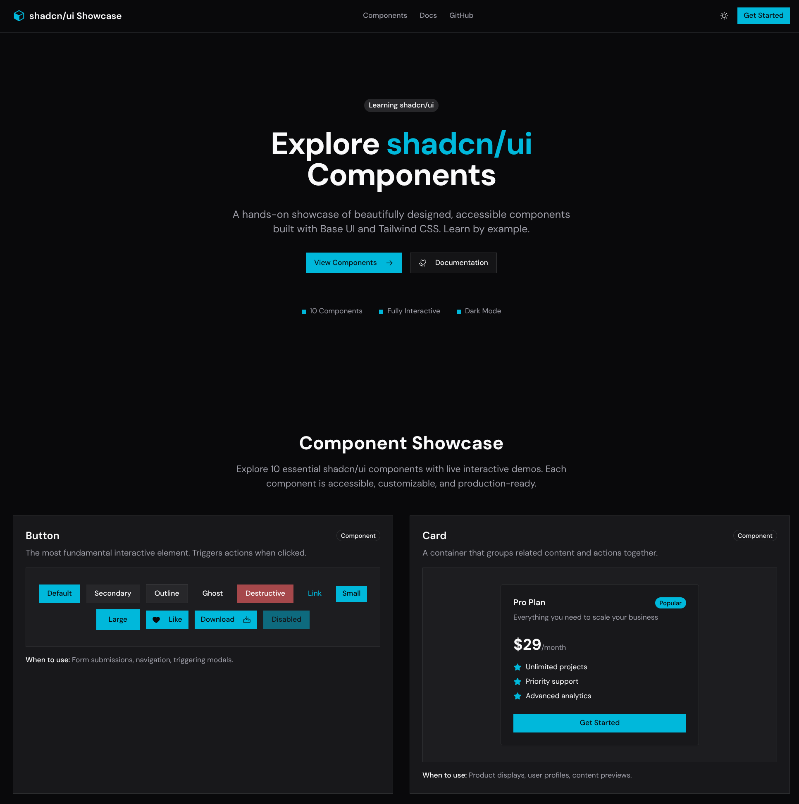
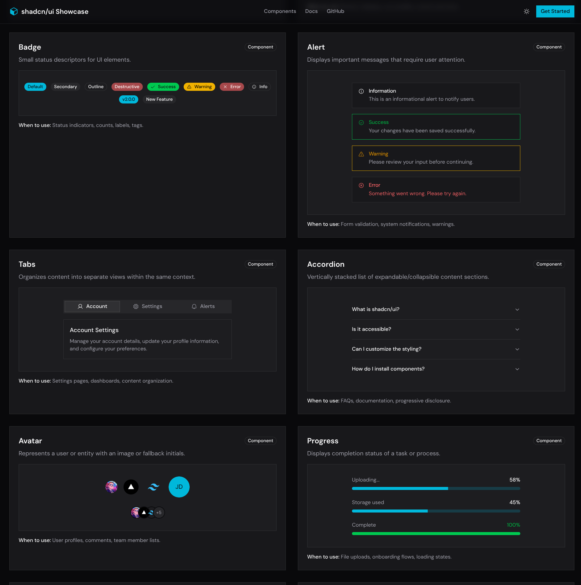

# shadcn/ui Component Showcase

A learning project showcasing 10 essential shadcn/ui components built with Next.js, Tailwind CSS, and Base UI.


## Preview

<p align="center">
  
  
</p>

### Component Demos

<p align="center">
  
</p>

## Features

- 10 interactive component demos with explanations
- Dark/light mode toggle
- Responsive grid layout
- Fully accessible components

## Components Showcased

| Component | Description |
|-----------|-------------|
| Button | Interactive buttons with multiple variants and sizes |
| Card | Content container with header, body, and footer |
| Badge | Status indicators and labels |
| Alert | Notification messages (info, success, warning, error) |
| Tabs | Tabbed content organization |
| Accordion | Expandable/collapsible content sections |
| Avatar | User profile images with fallbacks |
| Progress | Progress bars with animations |
| Switch | Toggle controls for settings |
| Dialog | Modal windows for forms and confirmations |

## Theme Configuration

| Setting | Value |
|---------|-------|
| Style | Maia |
| Base Color | Zinc |
| Accent | Cyan |
| Font | DM Sans |
| Icons | Phosphor |
| Radius | None (sharp corners) |

## Getting Started

```bash
# Install dependencies
npm install

# Run development server
npm run dev

# Build for production
npm run build
```

Open [http://localhost:3000](http://localhost:3000) to view the showcase.

## Project Structure

```
src/
├── app/
│   ├── layout.tsx        # Root layout with theme provider
│   ├── page.tsx          # Main landing page
│   └── globals.css       # Theme CSS variables
├── components/
│   ├── ui/               # shadcn/ui components
│   ├── showcase/         # Component demo implementations
│   ├── header.tsx        # Site header with nav
│   ├── hero.tsx          # Hero section
│   ├── footer.tsx        # Site footer
│   └── component-card.tsx # Demo wrapper component
└── lib/
    └── utils.ts          # Utility functions
```

## Tech Stack

- [Next.js 16](https://nextjs.org/) - React framework
- [shadcn/ui](https://ui.shadcn.com/) - Component library
- [Tailwind CSS](https://tailwindcss.com/) - Styling
- [Phosphor Icons](https://phosphoricons.com/) - Icon library
- [next-themes](https://github.com/pacocoursey/next-themes) - Theme management

## License

MIT
